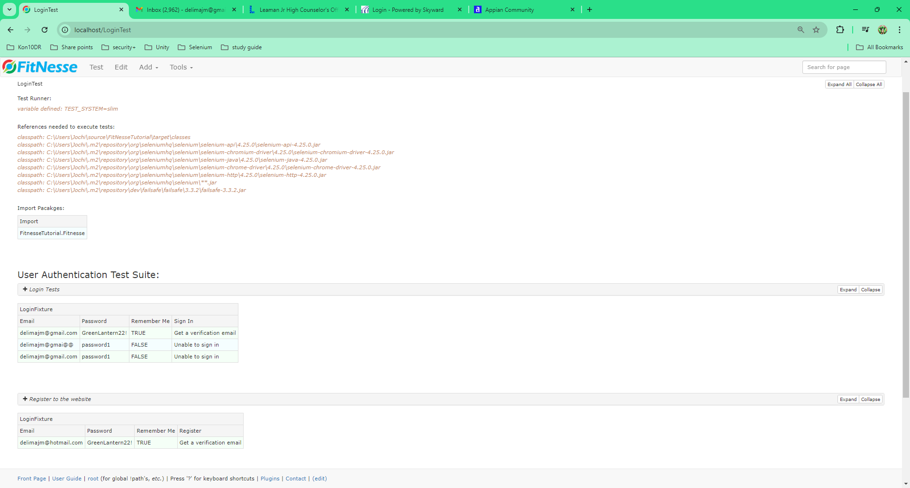
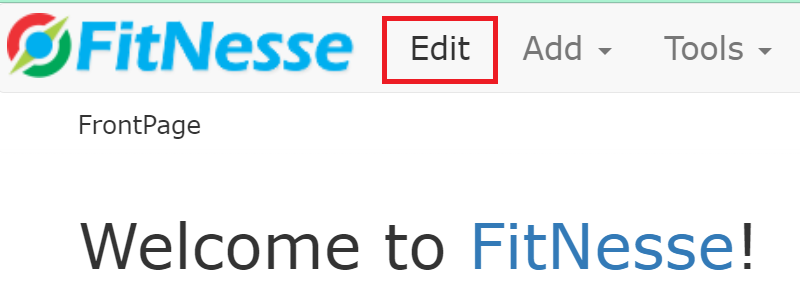
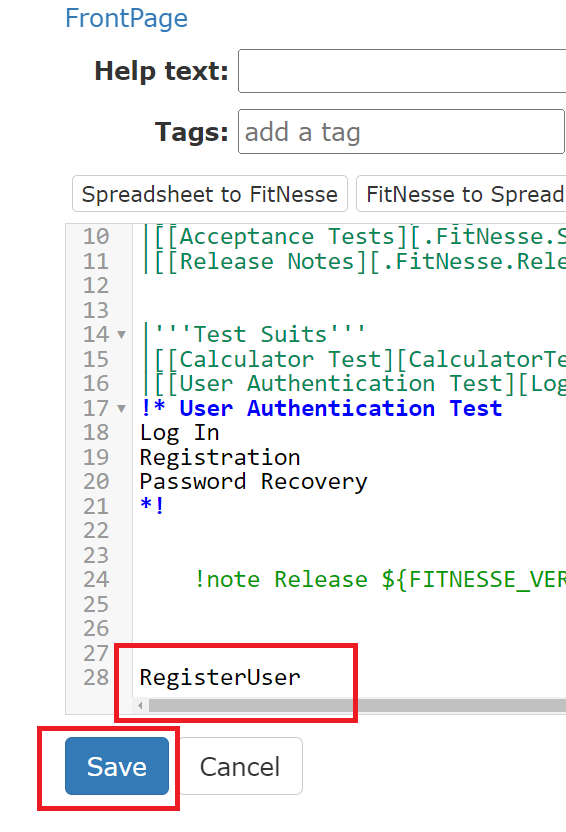
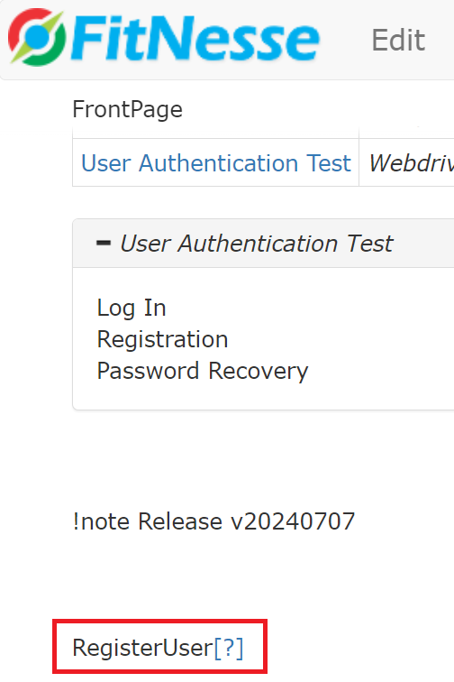

# FitNesse Project

This project is a sample FitNesse setup that helps you run tests using FitNesse, a testing framework that integrates with your Java codebase.

## Prerequisites

To run this project, ensure you have the following installed on your system:

- Java JDK (version 11)
- FitNesse (version `20240707`)
- Git (https://github.com/yeevon/FitNesseTutorial.git)

## Directory Structure

The key files are organized in the following structure:
```css
.
├── README.md
├── Src
│   └── main
│       └── java
│           └── FitnesseTutorial
│               └── Fitnesse
│                   └── [TestFiles and FitNesse related files]
└── External Libraries
    └── fitnesse-20240707.jar
```

## Setup Instructions

### Step 1: Clone the Project (if needed)

If you're using Git, you can clone this repository to your local machine:

```bash
git clone <https://github.com/yeevon/FitNesseTutorial.git>
```
Navigate to the project directory:
```bash
cd <project-directory>
```

### Step 2: Download FitNesse
FitNesse is added to as Maven dependency for this project no need for seperate download but if you want to download the jar: [FitNesse Download](https://fitnesse.org/FitNesseDownload.html)

### Step 3: Build Your Project
Build > Build Project

### Step 4: Start the FitNesse Server
Run FitNesse using the following command from the project root:
```bash
java -jar fitnesse-20240707.jar -p 8080
```
This command will start the FitNesse server, which will be available at http://localhost:8080.

### Step 5: Create/Run Tests
Navigate to http://localhost:8080 in your web browser.
You should see the FitNesse homepage.
Scroll down to Test suites to open Test pages.

### Step 6: Execute Tests
To run your tests, navigate to the corresponding test page in your FitNesse instance (for example, http://localhost:8080/LoginTest) and click "Test" to execute your tests.

## FitNesse Edit Wiki Pages

### FitNesse Home Page
Click on Edit to see how the home page was built and scroll to the bottom of the page to see Test Suite Section
For help on how to build wiki pages navigate through the user guide visit following links for help
[FitNesse Cheat Sheet](https://fitnesse.org/FitNesse/UserGuide/QuickReferenceGuide.html)
```markdown
!1 Welcome to [[FitNesse][FitNesse.FitNesse]]!
!3 ''The fully integrated stand-alone acceptance testing framework and wiki.''
# Here is a good place to add your first page (WikiWord). For example, MyTopLevelApplicationPage

To add your first "page", click the [[Edit][.FrontPage?edit]] button and add a [[!-WikiWord-!][.FitNesse.UserGuide.FitNesseWiki.WikiWord]] to the page.

|'''To Learn More...'''                                                                                            |
|[[User Guide][.FitNesse.UserGuide]]                                   |''Answer the rest of your questions here.''|
|[[A Two-Minute Example][.FitNesse.UserGuide.TwoMinuteExample]]        |''A brief example. Read this one next.''   |
|[[Acceptance Tests][.FitNesse.SuiteAcceptanceTests]]                  |''FitNesse's suite of Acceptance Tests''   |
|[[Release Notes][.FitNesse.ReleaseNotes]]                             |''Find out about FitNesse's new features'' |


|'''Test Suits'''                                                                                            |
|[[Calculator Test][CalculatorTest]]    |''Sample test created to verify linkage with fixtures''|
|[[User Authentication Test][LoginTest]]|''Webdriver test validating Appain commmunity website''|
!* User Authentication Test
Log In
Registration
Password Recovery
*!


!note Release ${FITNESSE_VERSION}
```


### WebDriver Test Suite
```markdown
!contents -R2 -g -p -f -h

!5 Test Runner:
!define TEST_SYSTEM {slim}

!5 References needed to execute tests:
!path C:\Users\Jochi\source\FitNesseTutorial\target\classes
!path C:\Users\Jochi\.m2\repository\org\seleniumhq\selenium\selenium-api\4.25.0\selenium-api-4.25.0.jar
!path C:\Users\Jochi\.m2\repository\org\seleniumhq\selenium\selenium-chromium-driver\4.25.0\selenium-chromium-driver-4.25.0.jar
!path C:\Users\Jochi\.m2\repository\org\seleniumhq\selenium\selenium-java\4.25.0\selenium-java-4.25.0.jar
!path C:\Users\Jochi\.m2\repository\org\seleniumhq\selenium\selenium-chrome-driver\4.25.0\selenium-chrome-driver-4.25.0.jar
!path C:\Users\Jochi\.m2\repository\org\seleniumhq\selenium\selenium-http\4.25.0\selenium-http-4.25.0.jar
!path C:\Users\Jochi\.m2\repository\org\seleniumhq\selenium\**.jar
!path C:\Users\Jochi\.m2\repository\dev\failsafe\failsafe\3.3.2\failsafe-3.3.2.jar

!5 Import Pacakges:
!|Import|
|FitnesseTutorial.Fitnesse|


!3 User Authentication Test Suite:
!*> Login Tests
1. Successful Login
2. Invalid email address
3. Invalid password
*!
!|LoginFixture|
|Email             |Password       |Remember Me|Sign In                 |
|delimajm@gmail.com|GreenLantern22!|TRUE       |Get a verification email|
|delimajm@gmai@@   |password1      |FALSE      |Unable to sign in       |
|delimajm@gmail.com|password1      |FALSE      |Unable to sign in       |


!*> Register to the website
There is a bug registration doesn't work
*!
!|LoginFixture|
|Email               |Password       |Remember Me|Register                |
|delimajm@hotmail.com|GreenLantern22!|TRUE       |Get a verification email|


!*> Reset Password Tests
1. Reset password for valid user
2. Reset password w/ invalid email
3. Reset password w/ unregistered email
*!
!|ForgotPasswordFixture|
|Forgot Password    |Email               |Reset                   |
|Reset your password|delimajm@gmail.com  |Get a verification email|
|Reset your password|delimajm@gmai@@     |Unable to sign in       |
|Reset your password|delimajm@hotmail.com|Unable to sign in       |
```


### Execute Tests
To run test from fitnesse all you need to do is navigate to: [Login Test](localhost:8080\LoginTest) Click Test:


## Create and Link Fixture files

### Create new Wiki page
In order to create new pages in Fitnesse you just have to enter page name in pascal case in edit view:
1. On Home Page click Edit

2. Enter name of the page you want to create like: RegisterUser
3. Save your changes

4. Click on the question mark to create your page


### Setup Test Page

1. Define Test Runner: At the top of the page under contents set test runner to slim
```markdown
!define TEST_SYSTEM {slim}
```
2. Reference jars needed to run your test, this will depend on how you have your test setup so you will need to identify all the jars needed to run your test. for this project you need:
```markdown
!path C:\Users\Jochi\source\FitNesseTutorial\target\classes
!path C:\Users\Jochi\.m2\repository\org\seleniumhq\selenium\selenium-api\4.25.0\selenium-api-4.25.0.jar
!path C:\Users\Jochi\.m2\repository\org\seleniumhq\selenium\selenium-chromium-driver\4.25.0\selenium-chromium-driver-4.25.0.jar
!path C:\Users\Jochi\.m2\repository\org\seleniumhq\selenium\selenium-java\4.25.0\selenium-java-4.25.0.jar
!path C:\Users\Jochi\.m2\repository\org\seleniumhq\selenium\selenium-chrome-driver\4.25.0\selenium-chrome-driver-4.25.0.jar
!path C:\Users\Jochi\.m2\repository\org\seleniumhq\selenium\selenium-http\4.25.0\selenium-http-4.25.0.jar
!path C:\Users\Jochi\.m2\repository\org\seleniumhq\selenium\**.jar
!path C:\Users\Jochi\.m2\repository\dev\failsafe\failsafe\3.3.2\failsafe-3.3.2.jar
```
**¡Note I did not use relative paths for this demo so make sure to update file locations before executing your tests!**
3. Next you have to import your java package where your test files are located:
```markdown
!|Import|
|FitnesseTutorial.Fitnesse|
```
4. Now you can create your test tables. Test tables have three parts
   1. Test File Name = Class file Name  
      ```markdown
      !|LoginFixture|
   2. Column Name = must start with key word like 'set' and the rest be in camel case i.e.(setEmail, setRememberMe) you can find more information about method names here: [Fixture Code](https://fitnesse.org/FitNesse/UserGuide/WritingAcceptanceTests/FixtureCode.html) 
      ```markdown
       |Email |Password |Remember Me |Sign In|
   3. Test Data = Is data being passed to the method or data that would be compared to what the method returns depending on how your test is set up reference: [Writing Acceptance Test](https://fitnesse.org/FitNesse/UserGuide/WritingAcceptanceTests.html)
      ```markdown
      |delimajm@gmail.com |GreenLantern22! |TRUE  |Get a verification email|
      |delimajm@gmai@@    |password1       |FALSE |Unable to sign in       |
      |delimajm@gmail.com |password1       |FALSE |Unable to sign in       |
      
5. Once that is complete you should be ready for running your test. Save your changes and click Test.

### Feature Files

For this demo I just created simple java classes and used selenium to run tests. If you want to execute test using junit to help organize your test reference: [Fitnesse w/ JUnit](https://docs.getxray.app/display/XRAY/Testing+using+FitNesse+and+JUnit)

Feature File Example: Forgot Password Tests
```java
package FitnesseTutorial.Fitnesse;

import org.openqa.selenium.By;
import org.openqa.selenium.WebDriver;
import org.openqa.selenium.WebElement;

public class ForgotPasswordFixture {
    private WebDriver driver;
    private final DriverSetup ds;

    public ForgotPasswordFixture() {
        ds = new DriverSetup();
    }

    public void setForgotPassword(String s) throws Exception{
        driver = ds.setup();
        try {
            WebElement _forgotPassword = driver.findElement(By.xpath("//*[@class='link js-forgot-password']"));
            _forgotPassword.click();
            ds.checkForText(driver, s);
        } catch (Exception e) {
            driver.quit();
            throw new Exception(e);
        }
    }

    public void setEmail(String email) throws Exception{
        try {
            Thread.sleep(4000);
            WebElement _email = driver.findElement(By.name("identifier"));
            _email.sendKeys(email);
        }
        catch (Exception e) {
            driver.quit();
            throw new Exception(e);
        }
    }

    public void setReset(String s) throws Exception{
        try {
            WebElement _nextButton = driver.findElement(By.xpath("//*[@value='Next']"));
            _nextButton.click();
            ds.checkForText(driver, s);
            ds.tearDown(driver);
        }
        catch (Exception e) {
            driver.quit();
            throw new Exception(e);
        }
    }
}
```

## Best Practices
1. FitNesse is organized for Data-Driven Testing so it is best to keep that in mind when creating feature files / test cases
2. While test can be run from the server hosting FitNesse it is best for **Devs/QAs** to pull down test to their local instance of FitNesse to execute the tests.
3. This version of FitNesse must be run with Java 11
4. If you are going to run FitNesse test from hosted server I recommended setting up Docker for executing the tests: [Docker Setup](https://medium.com/@sharmila.may5/steps-to-run-selenium-tests-in-docker-7610281a5581) or use a cloud service like '[BorwserStack](https://www.browserstack.com/)' or '[SauceLabs](https://saucelabs.com/)'


## MultiFactor Authentication

### 1. Get the Secret Key:

Navigate to your account settings in Salesforce and find the option to reconfigure the two-factor authentication (2FA).
Instead of scanning the QR code, look for an option that provides the Secret Key. Copy this key.
(See the image below for reference, if available.)

#### 2. Add the Required Library:

To generate the same verification code as Salesforce uses, include the following dependency in your project (assuming you're using Maven):

```xml
<dependency>
<groupId>de.taimos</groupId>
<artifactId>totp</artifactId>
<version>1.0</version>
</dependency>
```
### 3. Generate the Verification Code:

Use the following Java code to generate the TOTP (Time-based One-Time Password):
```java
import de.taimos.totp.TOTP;
import org.apache.commons.codec.binary.Base32;
import org.apache.commons.codec.binary.Hex;

public class Authenticator {

    // Method to generate the TOTP code
    public static String getTOTPCode(String secretKey) {
        Base32 base32 = new Base32();
        byte[] bytes = base32.decode(secretKey);
        String hexKey = Hex.encodeHexString(bytes);
        return TOTP.getOTP(hexKey); // Generates a TOTP code
    }

    public static void main(String[] args) {
        String secretKey = "";  // Replace with your actual secret key
        String code = getTOTPCode(secretKey);
        
        // Print the generated TOTP code
        System.out.println("Generated TOTP Code: " + code);
    }
}
```
### 4. Using the Generated Code:

Run the code above, and it will continuously print new 2FA codes.
Use the generated code in Salesforce to complete your login process.

Key Points:
* The TOTP library generates time-based codes similar to the ones generated by Google Authenticator, which Salesforce uses for 2FA.
* Replace String secretKey = ""; with your actual secret key from Salesforce.
* This process will generate the correct verification code, resolving your login issue.

Notes: Make sure to handle your secret key securely. The code example will generate a new TOTP code every 30 seconds, which matches the behavior of Salesforce’s 2FA.


## Extract PDF URL from the iframe and Download
   This is the preferred and easier method. You can extract the PDF URL from the iframe, download the PDF directly, and then parse it using PDFBox.

Here’s how you can do it:

```java
import org.apache.pdfbox.pdmodel.PDDocument;
import org.apache.pdfbox.text.PDFTextStripper;
import org.junit.Assert;
import org.junit.Before;
import org.junit.Test;
import org.openqa.selenium.By;
import org.openqa.selenium.WebDriver;
import org.openqa.selenium.WebElement;
import org.openqa.selenium.chrome.ChromeDriver;

import java.io.File;
import java.io.FileInputStream;
import java.io.IOException;
import java.net.URL;
import java.nio.file.Files;
import java.nio.file.Paths;

public class PdfIframeTest {
private WebDriver driver;

    @Before
    public void setUp() {
        // Set up your WebDriver (assuming ChromeDriver)
        System.setProperty("webdriver.chrome.driver", "path/to/chromedriver");
        driver = new ChromeDriver();
    }

    @Test
    public void testPdfContentInIframe() throws IOException {
        // Step 1: Navigate to the page with the iframe
        driver.get("http://example.com/pdf-in-iframe");

        // Step 2: Switch to the iframe containing the PDF
        WebElement iframe = driver.findElement(By.tagName("iframe"));
        driver.switchTo().frame(iframe);

        // Step 3: Extract the URL of the PDF from the iframe (src attribute)
        String pdfUrl = driver.findElement(By.tagName("iframe")).getAttribute("src");
        
        // Step 4: Download the PDF file
        downloadPdf(pdfUrl, "downloaded_pdf.pdf");

        // Step 5: Parse the downloaded PDF using PDFBox and verify the content
        try (FileInputStream fileInputStream = new FileInputStream("downloaded_pdf.pdf")) {
            PDDocument document = PDDocument.load(fileInputStream);
            PDFTextStripper pdfStripper = new PDFTextStripper();
            String pdfText = pdfStripper.getText(document);

            // Assert that the PDF contains the expected content
            Assert.assertTrue(pdfText.contains("Expected content in the PDF"));
            document.close();
        }
    }

    private void downloadPdf(String pdfUrl, String destinationPath) throws IOException {
        // Step to download the PDF file from the URL
        URL url = new URL(pdfUrl);
        Files.copy(url.openStream(), Paths.get(destinationPath));
    }
}
```

## Setup FitNesse admin users / Customize user.config

### Step 1: Configure FitNesse for User Authentication
To enable user authentication in FitNesse, you need to configure its authentication settings by modifying the fitnesse.properties file.

#### 1.1 Modify fitnesse.properties
FitNesse uses a configuration file (fitnesse.properties) to manage settings, including user authentication. Here’s how to enable and configure it:

Open the fitnesse.properties file, which is located in the root directory of your FitNesse installation.
Add or modify the following entries in the file:

```properties
# Enable user authentication
AUTHENTICATION_TYPE=filesystem

# Path to the user configuration file (which defines the users and their roles)
USERS=FitNesseRoot/UserConfig/users.xml
```
* AUTHENTICATION_TYPE=filesystem tells FitNesse to use filesystem-based authentication, where user credentials and roles are stored in an XML file.


* USERS=FitNesseRoot/UserConfig/users.xml specifies the location of the users.xml file, which contains user definitions. This file doesn't exist by default, so you'll need to create it.

#### 1.2 Create the users.xml File
The users.xml file is where you define users and assign roles. Create this file in the FitNesseRoot/UserConfig/ directory (you may need to create the UserConfig folder if it doesn't exist).

Here’s an example of a users.xml file that sets up an admin user:

```xml
<?xml version="1.0" encoding="UTF-8"?>
<users>
  <user username="admin" password="adminpassword" roles="admin"/>
  <user username="editor" password="editorpassword" roles="editor"/>
  <user username="viewer" password="viewerpassword" roles="viewer"/>
</users>
```

* username: The username for the user.
* password: The password for the user.
* roles: The role assigned to the user (e.g., admin, editor, viewer).

#### You can customize the roles and users as needed. For instance:
* Admin: Full access to all features (including editing and administration).
* Editor: Access to modify pages but not administer.
* Viewer: Read-only access.

### Step 2: Define Roles and Permissions
Now that the users are set up, you need to define what each role can do. FitNesse provides a simple way to configure access control based on roles.

#### 2.1 Modify Permissions on Pages
You can restrict access to specific pages or sections of your FitNesse wiki by setting permissions at the page level. You do this by adding security properties directly to the page content.

1. Navigate to the page you want to restrict (e.g., an admin-specific page).
2. Click "Edit" to edit the page.
3. At the top of the page, add the following directive to restrict access:
```html
!define AUTHENTICATE_USER {true}
!define ALLOWED_ROLES {admin}
```
* AUTHENTICATE_USER: This directive enables user authentication for the page.
* ALLOWED_ROLES: This defines which roles can access the page. In this example, only users with the admin role can access it.

 
### Step 3: Start FitNesse and Test the Admin User
1. Restart FitNesse if it’s already running, to apply the new configuration:

```bash
java -jar fitnesse-standalone.jar
```
2. Navigate to FitNesse in your browser (e.g., http://localhost:8080).

3. Try accessing pages:
* Log in with the admin user credentials.
* Attempt to access an admin-restricted page, and you should have full access.
* Try logging in as another user (e.g., editor or viewer) and check the permissions to ensure the correct roles are enforced.

### Step 4: Optional – Customize Login Behavior
You can also customize the login behavior by providing a login page. Here’s how you can configure a simple login mechanism:

1. Create a login page in FitNesse (e.g., FitNesseRoot/LoginPage).
2. Use the following template to create a login form:
```html
!define AUTHENTICATE_USER {true}
!define ALLOWED_ROLES {admin,editor,viewer}

Please log in to access the page.
<form action="/FrontPage" method="post">
    Username: <input type="text" name="username"/><br/>
    Password: <input type="password" name="password"/><br/>
    <input type="submit" value="Login"/>
</form>
```
* This form will authenticate users based on the credentials defined in the users.xml file.
### Step 5: Enforce HTTPS (Optional but Recommended)
For security, it’s recommended to run FitNesse behind an HTTPS server (e.g., using Nginx or Apache as a reverse proxy with SSL), especially if it’s exposed to the internet.