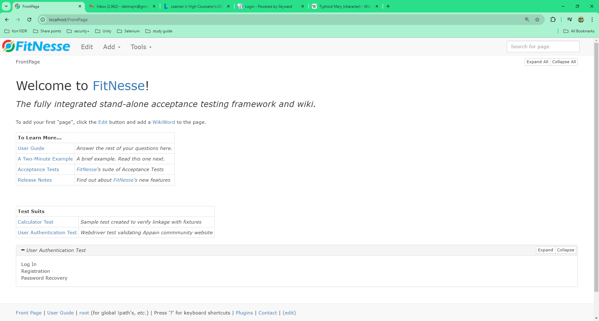
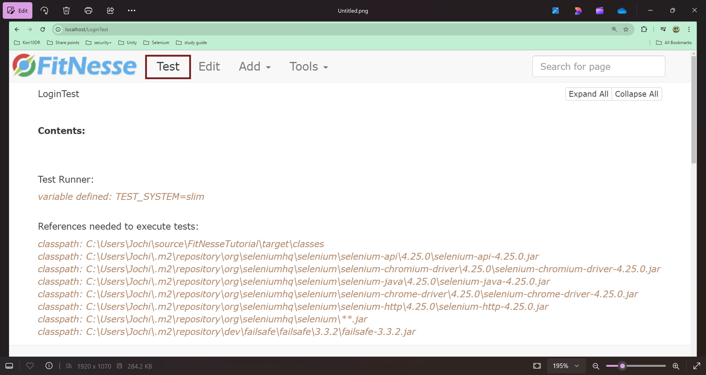

# FitNesse Project

This project is a sample FitNesse setup that helps you run tests using FitNesse, a testing framework that integrates with your Java codebase.

## Prerequisites

To run this project, ensure you have the following installed on your system:

- Java JDK (version 11)
- FitNesse (version `20240707`)
- Git (https://github.com/yeevon/FitNesseTutorial.git)

## Directory Structure

The key files are organized in the following structure:
```css
.
├── README.md
├── Src
│   └── main
│       └── java
│           └── FitnesseTutorial
│               └── Fitnesse
│                   └── [TestFiles and FitNesse related files]
└── External Libraries
    └── fitnesse-20240707.jar
```

## Setup Instructions

### Step 1: Clone the Project (if needed)

If you're using Git, you can clone this repository to your local machine:

```bash
git clone <https://github.com/yeevon/FitNesseTutorial.git>
```
Navigate to the project directory:
```bash
cd <project-directory>
```

### Step 2: Download FitNesse
FitNesse is added to as Maven dependency for this project no need for seperate download but if you want to download the jar: [FitNesse Download](https://fitnesse.org/FitNesseDownload.html)

### Step 3: Build Your Project
Build > Build Project

### Step 4: Start the FitNesse Server
Run FitNesse using the following command from the project root:
```bash
java -jar fitnesse-20240707.jar -p 8080
```
This command will start the FitNesse server, which will be available at http://localhost:8080.

### Step 5: Create/Run Tests
Navigate to http://localhost:8080 in your web browser.
You should see the FitNesse homepage.
Scroll down to Test suites to open Test pages.

### Step 6: Execute Tests
To run your tests, navigate to the corresponding test page in your FitNesse instance (for example, http://localhost:8080/LoginTest) and click "Test" to execute your tests.

## FitNesse Edit Wiki Pages

### FitNesse Home Page
Click on Edit to see how the home page was built and scroll to the bottom of the page to see Test Suite Section
For help on how to build wiki pages navigate through the user guide visit following links for help
[FitNesse Cheat Sheet](https://fitnesse.org/FitNesse/UserGuide/QuickReferenceGuide.html)
```markdown
!1 Welcome to [[FitNesse][FitNesse.FitNesse]]!
!3 ''The fully integrated stand-alone acceptance testing framework and wiki.''
# Here is a good place to add your first page (WikiWord). For example, MyTopLevelApplicationPage

To add your first "page", click the [[Edit][.FrontPage?edit]] button and add a [[!-WikiWord-!][.FitNesse.UserGuide.FitNesseWiki.WikiWord]] to the page.

|'''To Learn More...'''                                                                                            |
|[[User Guide][.FitNesse.UserGuide]]                                   |''Answer the rest of your questions here.''|
|[[A Two-Minute Example][.FitNesse.UserGuide.TwoMinuteExample]]        |''A brief example. Read this one next.''   |
|[[Acceptance Tests][.FitNesse.SuiteAcceptanceTests]]                  |''FitNesse's suite of Acceptance Tests''   |
|[[Release Notes][.FitNesse.ReleaseNotes]]                             |''Find out about FitNesse's new features'' |


|'''Test Suits'''                                                                                            |
|[[Calculator Test][CalculatorTest]]    |''Sample test created to verify linkage with fixtures''|
|[[User Authentication Test][LoginTest]]|''Webdriver test validating Appain commmunity website''|
!* User Authentication Test
Log In
Registration
Password Recovery
*!


!note Release ${FITNESSE_VERSION}
```



### WebDriver Test Suite
```markdown
!contents -R2 -g -p -f -h

!5 Test Runner:
!define TEST_SYSTEM {slim}

!5 References needed to execute tests:
!path C:\Users\Jochi\source\FitNesseTutorial\target\classes
!path C:\Users\Jochi\.m2\repository\org\seleniumhq\selenium\selenium-api\4.25.0\selenium-api-4.25.0.jar
!path C:\Users\Jochi\.m2\repository\org\seleniumhq\selenium\selenium-chromium-driver\4.25.0\selenium-chromium-driver-4.25.0.jar
!path C:\Users\Jochi\.m2\repository\org\seleniumhq\selenium\selenium-java\4.25.0\selenium-java-4.25.0.jar
!path C:\Users\Jochi\.m2\repository\org\seleniumhq\selenium\selenium-chrome-driver\4.25.0\selenium-chrome-driver-4.25.0.jar
!path C:\Users\Jochi\.m2\repository\org\seleniumhq\selenium\selenium-http\4.25.0\selenium-http-4.25.0.jar
!path C:\Users\Jochi\.m2\repository\org\seleniumhq\selenium\**.jar
!path C:\Users\Jochi\.m2\repository\dev\failsafe\failsafe\3.3.2\failsafe-3.3.2.jar

!5 Import Pacakges:
!|Import|
|FitnesseTutorial.Fitnesse|


!3 User Authentication Test Suite:
!*> Login Tests
1. Successful Login
2. Invalid email address
3. Invalid password
*!
!|LoginFixture|
|Email             |Password       |Remember Me|Sign In                 |
|delimajm@gmail.com|GreenLantern22!|TRUE       |Get a verification email|
|delimajm@gmai@@   |password1      |FALSE      |Unable to sign in       |
|delimajm@gmail.com|password1      |FALSE      |Unable to sign in       |


!*> Register to the website
There is a bug registration doesn't work
*!
!|LoginFixture|
|Email               |Password       |Remember Me|Register                |
|delimajm@hotmail.com|GreenLantern22!|TRUE       |Get a verification email|


!*> Reset Password Tests
1. Reset password for valid user
2. Reset password w/ invalid email
3. Reset password w/ unregistered email
*!
!|ForgotPasswordFixture|
|Forgot Password    |Email               |Reset                   |
|Reset your password|delimajm@gmail.com  |Get a verification email|
|Reset your password|delimajm@gmai@@     |Unable to sign in       |
|Reset your password|delimajm@hotmail.com|Unable to sign in       |
```


### Execute Tests
To run test from fitnesse all you need to do is navigate to: [Login Test](localhost:8080\LoginTest) Click Test:



## Create and Link Fixture files

### Create new Wiki page
In order to create new pages in Fitnesse you just have to enter page name in pascal case in edit view:
1. On Home Page click Edit

2. Enter name of the page you want to create like: RegisterUser
3. Save your changes

4. Click on the question mark to create your page


### Setup Test Page

1. Define Test Runner: At the top of the page under contents set test runner to slim
```markdown
!define TEST_SYSTEM {slim}
```
2. Reference jars needed to run your test, this will depend on how you have your test setup so you will need to identify all the jars needed to run your test. for this project you need:
```markdown
!path C:\Users\Jochi\source\FitNesseTutorial\target\classes
!path C:\Users\Jochi\.m2\repository\org\seleniumhq\selenium\selenium-api\4.25.0\selenium-api-4.25.0.jar
!path C:\Users\Jochi\.m2\repository\org\seleniumhq\selenium\selenium-chromium-driver\4.25.0\selenium-chromium-driver-4.25.0.jar
!path C:\Users\Jochi\.m2\repository\org\seleniumhq\selenium\selenium-java\4.25.0\selenium-java-4.25.0.jar
!path C:\Users\Jochi\.m2\repository\org\seleniumhq\selenium\selenium-chrome-driver\4.25.0\selenium-chrome-driver-4.25.0.jar
!path C:\Users\Jochi\.m2\repository\org\seleniumhq\selenium\selenium-http\4.25.0\selenium-http-4.25.0.jar
!path C:\Users\Jochi\.m2\repository\org\seleniumhq\selenium\**.jar
!path C:\Users\Jochi\.m2\repository\dev\failsafe\failsafe\3.3.2\failsafe-3.3.2.jar
```
**¡Note I did not use relative paths for this demo so make sure to update file locations before executing your tests!**
3. Next you have to import your java package where your test files are located:
```markdown
!|Import|
|FitnesseTutorial.Fitnesse|
```
4. Now you can create your test tables. Test tables have three parts
   1. Test File Name = Class file Name  
      ```markdown
      !|LoginFixture|
   2. Column Name = must start with key word like 'set' and the rest be in camel case i.e.(setEmail, setRememberMe) you can find more information about method names here: [Fixture Code](https://fitnesse.org/FitNesse/UserGuide/WritingAcceptanceTests/FixtureCode.html) 
      ```markdown
       |Email |Password |Remember Me |Sign In|
   3. Test Data = Is data being passed to the method or data that would be compared to what the method returns depending on how your test is set up reference: [Writing Acceptance Test](https://fitnesse.org/FitNesse/UserGuide/WritingAcceptanceTests.html)
      ```markdown
      |delimajm@gmail.com |GreenLantern22! |TRUE  |Get a verification email|
      |delimajm@gmai@@    |password1       |FALSE |Unable to sign in       |
      |delimajm@gmail.com |password1       |FALSE |Unable to sign in       |
      
5. Once that is complete you should be ready for running your test. Save your changes and click Test.

### Feature Files

For this demo I just created simple java classes and used selenium to run tests. If you want to execute test using junit to help organize your test reference: [Fitnesse w/ JUnit](https://docs.getxray.app/display/XRAY/Testing+using+FitNesse+and+JUnit)

Feature File Example: Forgot Password Tests
```java
package FitnesseTutorial.Fitnesse;

import org.openqa.selenium.By;
import org.openqa.selenium.WebDriver;
import org.openqa.selenium.WebElement;

public class ForgotPasswordFixture {
    private WebDriver driver;
    private final DriverSetup ds;

    public ForgotPasswordFixture() {
        ds = new DriverSetup();
    }

    public void setForgotPassword(String s) throws Exception{
        driver = ds.setup();
        try {
            WebElement _forgotPassword = driver.findElement(By.xpath("//*[@class='link js-forgot-password']"));
            _forgotPassword.click();
            ds.checkForText(driver, s);
        } catch (Exception e) {
            driver.quit();
            throw new Exception(e);
        }
    }

    public void setEmail(String email) throws Exception{
        try {
            Thread.sleep(4000);
            WebElement _email = driver.findElement(By.name("identifier"));
            _email.sendKeys(email);
        }
        catch (Exception e) {
            driver.quit();
            throw new Exception(e);
        }
    }

    public void setReset(String s) throws Exception{
        try {
            WebElement _nextButton = driver.findElement(By.xpath("//*[@value='Next']"));
            _nextButton.click();
            ds.checkForText(driver, s);
            ds.tearDown(driver);
        }
        catch (Exception e) {
            driver.quit();
            throw new Exception(e);
        }
    }
}
```

## Best Practices
1. FitNesse is organized for Data-Driven Testing so it is best to keep that in mind when creating feature files / test cases
2. While test can be run from the server hosting FitNesse it is best for **Devs/QAs** to pull down test to their local instance of FitNesse to execute the tests.
3. This version of FitNesse must be run with Java 11
4. If you are going to run FitNesse test from hosted server I recommended setting up Docker for executing the tests: [Docker Setup](https://medium.com/@sharmila.may5/steps-to-run-selenium-tests-in-docker-7610281a5581) or use a cloud service like '[BorwserStack](https://www.browserstack.com/)' or '[SauceLabs](https://saucelabs.com/)'
